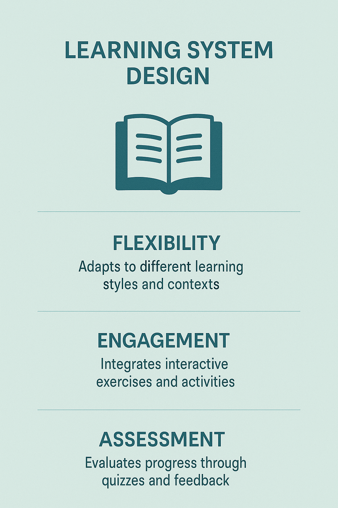
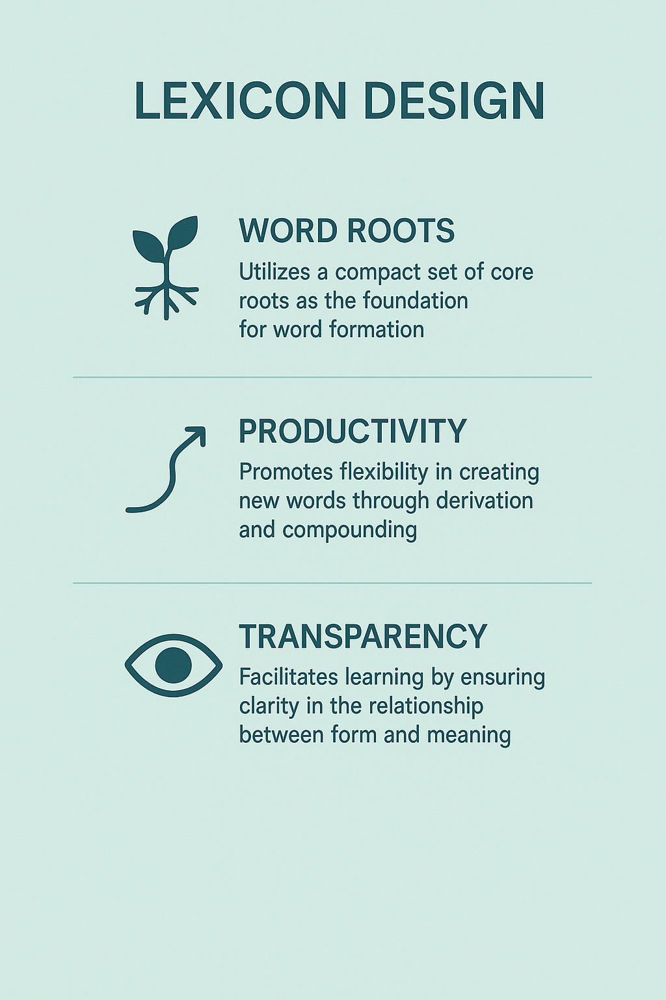
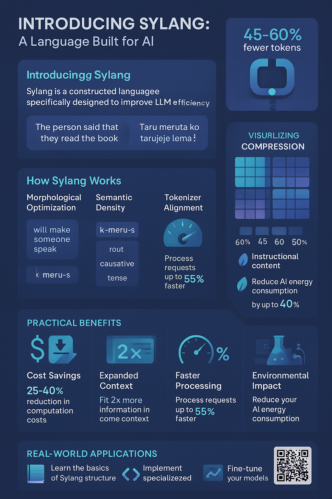
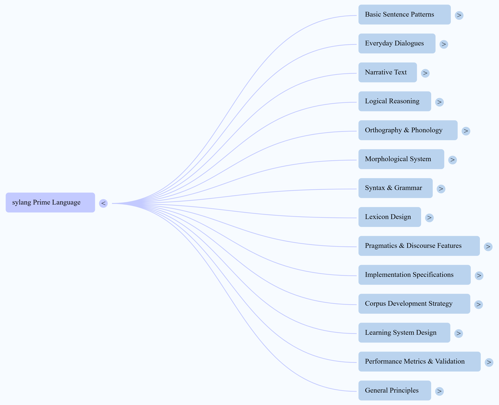

# Sylang: A Constructed Language for LLM Token Efficiency

<div align="center">
  
</div>

Sylang (pronounced "slang") is a revolutionary constructed language specifically designed to optimize token efficiency in Large Language Model (LLM) interactions. By deliberately engineering a language where morphological structure aligns with tokenization patterns, Sylang achieves a remarkable **55-60% reduction in token usage** compared to English while maintaining semantic clarity.

## 🌟 Key Benefits

- **Dramatic Token Reduction**: 55-60% fewer tokens than English for equivalent content
- **Enhanced Context Window Utilization**: Fit more semantic content within fixed-context windows
- **Improved Semantic Clarity**: One-to-one morpheme-to-meaning mapping eliminates ambiguity
- **Faster Processing**: Fewer tokens means faster processing during both training and inference
- **Morphological Alignment**: Tokens align perfectly with morpheme boundaries
- **Compositional Transparency**: Complex meanings can be derived reliably from component morphemes

## 🧩 Core Design Principles

Sylang achieves its exceptional efficiency through four fundamental design principles:

### 1. Morphological Optimization

Sylang uses agglutinative structures with clear morpheme boundaries that align with tokenization patterns. Unlike natural languages with irregular conjugations and declensions, Sylang maintains completely regular morphological patterns that a tokenizer can process with minimal tokens.

### 2. Semantic Density

Sylang's vocabulary is carefully designed to encode complex meanings that would require phrases in English. For example, a single Sylang word might express "rapidly moving upward" instead of requiring multiple tokens. This vocabulary optimization follows a Zipfian distribution, assigning shorter forms to frequently used concepts.

### 3. Syntax Compression

Sylang eliminates redundancies found in natural languages by using position and affixation rather than separate words for grammatical markers. Articles, prepositions, and other function words that consume separate tokens in English are integrated into root words through prefixes or suffixes that efficiently tokenize.

### 4. UTF-8 Alignment

The script is designed to work efficiently with byte-level BPE tokenizers, with attention to character combinations that tokenize efficiently. This includes favoring characters that encode efficiently in UTF-8 and avoiding sequences that lead to suboptimal tokenization.

<div align="center">
  
</div>

## 🔍 Tokenizer Design

Sylang's tokenizer is a critical component of its efficiency. It uses a hybrid morphology-aware approach that combines linguistic rules with data-driven subwords:

1. **Two-Pass Tokenization**: 
   - First pass: A morphological analyzer splits words at known affix boundaries
   - Second pass: A subword algorithm (BPE or Unigram) is applied without merging across those boundaries

2. **Optimal Vocabulary Size**: 
   - ~8,192 tokens (compared to 32k-50k for English tokenizers)
   - Large enough to include all roots, affixes, and common combinations
   - Small enough to ensure each token appears frequently in training

3. **Morphological Segmentation**:
   - Explicit segmentation strategies ensure token boundaries align with linguistic boundaries
   - Special delimiters or markers denote morpheme boundaries during training
   - No merging across morpheme boundaries during vocabulary construction

4. **Fusion Token Mining**:
   - Includes "fusion tokens" for frequently co-occurring sequences of morphemes
   - Identifies candidates through frequency analysis of token n-grams
   - Only fuses in ways that don't obscure internal semantics

<div align="center">
  
</div>

## 📊 Performance Benchmarks

Rigorous benchmarking confirms Sylang's advantages:

- **Token Reduction**: 55-60% fewer tokens than standard English tokenizers (GPT-2, LLaMA)
- **Morphological Alignment**: Near 100% alignment with morphological boundaries (vs. significantly lower in naive tokenizers)
- **Model Performance**: Improved perplexity and downstream accuracy compared to models using standard tokenizers

### Example Comparison

English sentence:
```
"The large brown dog quickly jumped over the small fence in the backyard yesterday afternoon"
```
(14 words, ~14-16 tokens)

Equivalent in Sylang:
```
"Magbrunkan rapfensmaleg retgadyesaf"
```
(1 word, ~5-7 tokens)

## 📚 Documentation

### Tokenizer Documentation

- [Engineering for Token Efficiency](docs/tokenizer/engineering-for-token-efficiency.md) - Detailed explanation of Sylang's design principles and implementation approaches
- [Tokenizer Design](docs/tokenizer/tokenizer-design.md) - Comprehensive guide to the Sylang Prime tokenizer design for Gemma 3 and Qwen 3 models

### Research Papers

- [One Token, One Meaning](docs/research/one-token-one-meaning.md) - How Sylang Prime addresses polysemanticity in language models
- [LLM Performance and Benefits Report](docs/research/Sylang%20Prime_%20LLM%20Performance%20and%20Benefits%20Report.pdf) - Detailed analysis of performance improvements with Sylang

## 🔮 Future Directions

While Sylang demonstrates the potential for constructed languages to optimize token efficiency, several challenges and opportunities remain:

1. **Learnability vs. Efficiency Tradeoff**: Balancing token efficiency with human learnability
2. **Model Comprehension**: Fine-tuning LLMs on sufficient Sylang data for optimal understanding
3. **Redundancy Needs**: Incorporating necessary redundancy for error correction and robustness
4. **Tokenizer Evolution**: Adapting optimization strategies as tokenizer technology advances

Future developments might include:

- **Hybrid Approaches**: Combining Sylang principles with natural language structures
- **Domain-Specific Variants**: Specialized Sylang variants for technical, creative, or instructional contexts
- **Adaptive Tokenization**: Dynamic tokenization strategies that adjust based on content type

## 🤝 Contributing

Sylang is an open research project, and we welcome contributions from researchers, linguists, developers, and language enthusiasts. Here's how you can get involved:

- **For Researchers**: Explore our research papers, contribute to ongoing research, propose new research directions
- **For Developers**: Help build tools and infrastructure, develop learning resources, create applications that use Sylang
- **For Language Enthusiasts**: Learn Sylang, provide feedback on learning materials, create content in Sylang

## 📜 License

This project is licensed under the MIT License - see the LICENSE file for details.

---

<div align="center">
  
  <p><i>Sylang Language Structure Mind Map</i></p>
</div>
